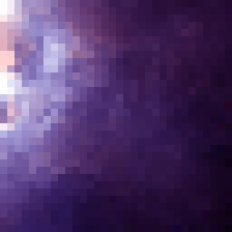

# 8-Bit Image Pixelator
Creates an 8-bit pixelated version of an image

- Performs [**color quantization**](https://en.wikipedia.org/wiki/Color_quantization) on an image:
  - Reduces the distinct number of colors used in the image
- Determines the reduced color palette by recursively implementing the [**median cut algorithm**](https://en.wikipedia.org/wiki/Median_cut):
  1. Put all of the pixels of the image in one group.
  2. Find out which RGB color channel (red, green, or blue) has the greatest range and sort the pixels in the group by that channel's values (e.g., if the red channel has the greatest range, then a pixel with RGB values of (32, 8, 16) would come after a pixel with RGB values of (16, 4, 24) because 32 > 16).
  3. Split the group into 2 subgroups at its midpoint or *median* and repeat the above steps for each subgroup. Stop splitting once the desired number of colors is reached (each group will represent one color, so the number of colors must be a power of 2).
  4. For each group, average the RGB values of all of the pixels to get one color for that grouping. Recolor all pixels in that group with this color.

- After color quantization, the image is "pixelated" by grouping the pixels into larger pixel groups (e.g., 8 x 8 pixel groups):
  - For each pixel group, every pixel's color is counted and stored in a hash table
  - The dominant color is used to recolor every pixel in the pixel group

**Notes**:
- Currently only works on square images
- Supports .png, .jpg, .jpeg, and .jfif formats
- Outputs all pixelated images to .png format

## GUI

 

- Number of colors can be adjusted to any power of 2 from 2 - 1024

## Examples

## Next Steps

- Fix bug with background colors being changed (see firefox-4 above)
- Add support for pictures with transparency properties
- Add support for cropping non-square images through GUI
- Add support for specifying the output image dimensions using squares as units
